# Документация по телеграмм-боту EnglishCards

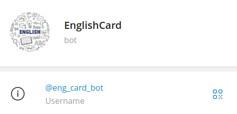

Этот бот предлагает пользователям удобный и интерактивный способ запоминания английской лексики, предоставляя возможность добавлять, удалять и изучать карточки слов на английском языке. 

Он позволяет:

- Создавать карточки: Пользователи могут добавлять новые слова с переводом, что позволяет расширять свой словарный запас.
- Удалять карточки: Система предоставляет простые команды для удаления ненужных карточек.
- Динамическое обучение: Бот предлагает режим тренировки, чтобы пользователи могли закреплять знания через интерактивные упражнения в виде тестов с вариантами ответа.
- Просматривать карточки: Бот позволяет каждому пользователю показать личный список карточек для изучения.

## Про пользование и функционал

Чтобы воспользоваться функционалом бота, его нужно запустить.

После запуска и вывода в консоль комманды "Bot is currently running..." начнется бесконечный цикл проверки наличия обновлений действий от пользователя. В случае выполнения той или иной комманды будет использоваться определенный обработчик.

Для начала работы с ботом, ему можно написать базовую комманду /start:

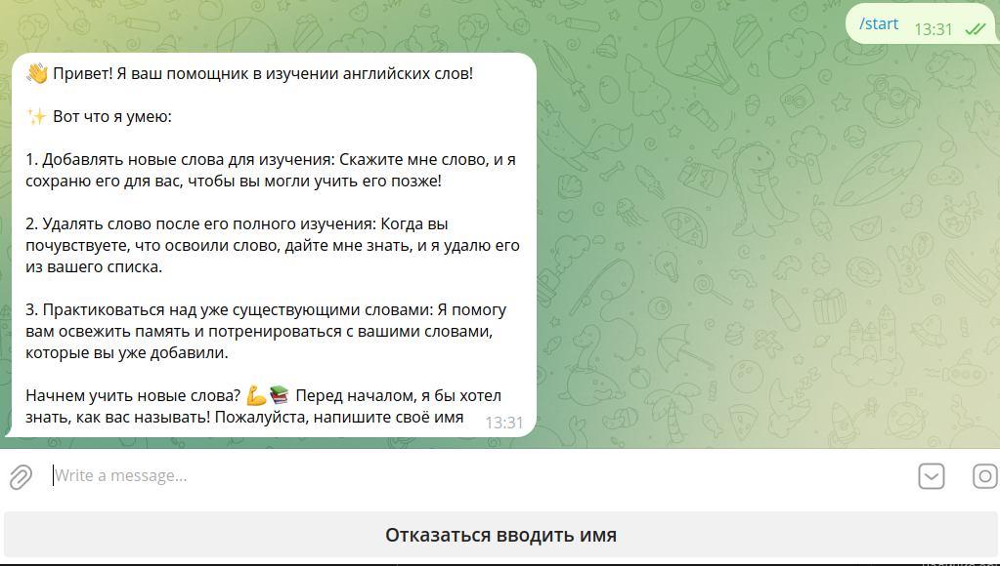

Далее бот требует имя. Если пользователь не хочет его распространять, он вправе отказаться. В таком случае он будет числиться в базе данных как "Аноним".

Далее, у пользователя есть выбор:
* Добавить слово;
* Удалить слово;
* Тренироваться;
* Получить справку о боте;
* Получить все изучаемые слова.

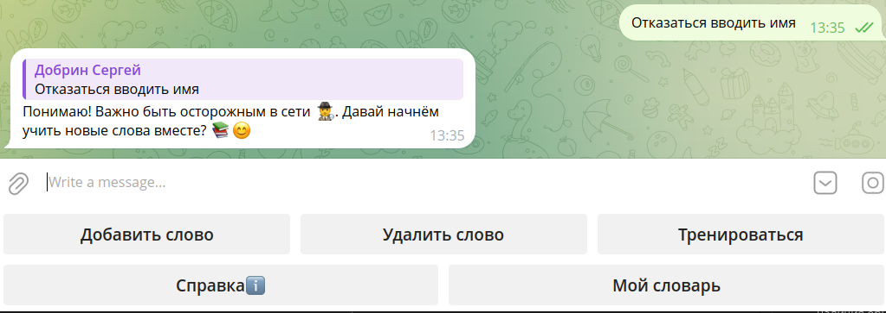

### Добавление слова:

По нажатию данной кнопки пользователю предлагается добавить слово __на английском__. 

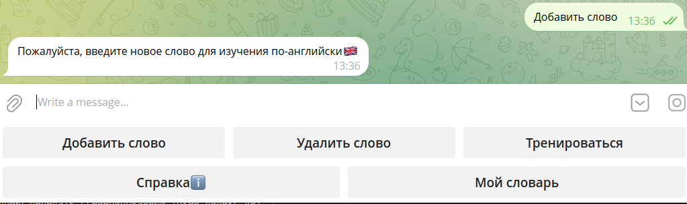

В случае, если пользователь введет символы, отличные от латиницы, символа дефиса и пробела, бот скажет, что такое слово некорректно и будет ожидать еще одно английское слово. 

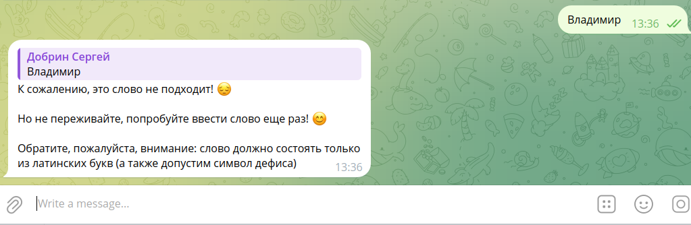

В случае же успеха бот ожидает ввод перевода этого слова. В случае, если пользователь доверяет перевод боту, он может нажать на соответствующую кнопку "Переведи мое слово сам". Тогда будет выполнен запрос на API Яндекса для словарей и будет произведена попытка перевода. В случае удачи создастся пара слов "англ-рус" и она добавится в базу данных. В случае неудачи перевода, пользователю придется ввести перевод самостоятельно.

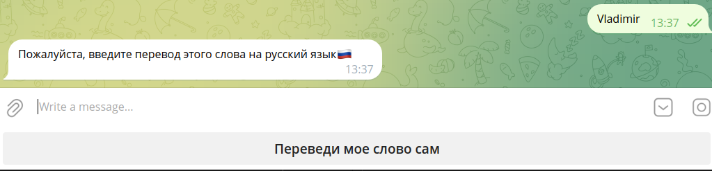

__Удача:__

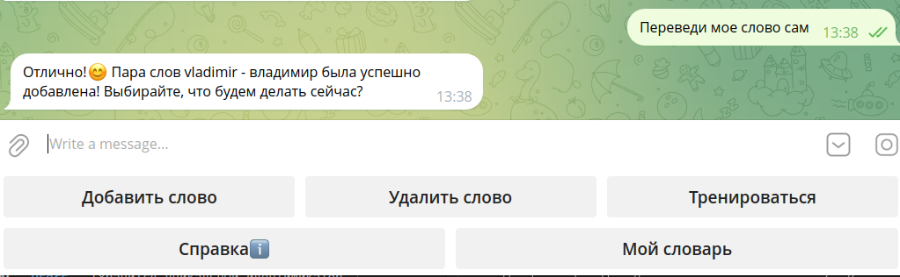

__Неудача:__

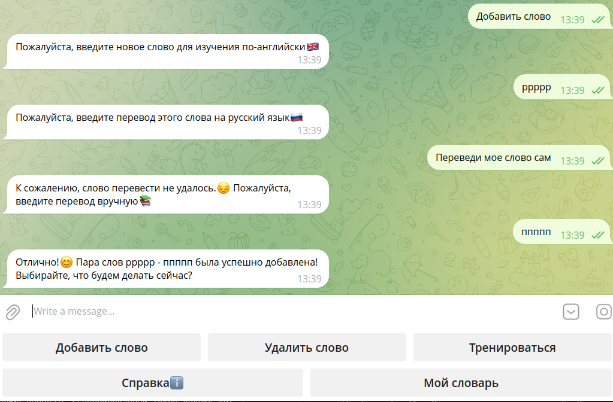

### Удаление слова:

Слова из базы данных можно удалить. Изначально при запуске бота и создании базы данных к нему, в эту бд были добавлены слова, которые должны быть доступны у всех пользователей. Такие слова удалять ни глобально ни локально нельзя. Удалить можно только добавленное самим слово. Вот пример:

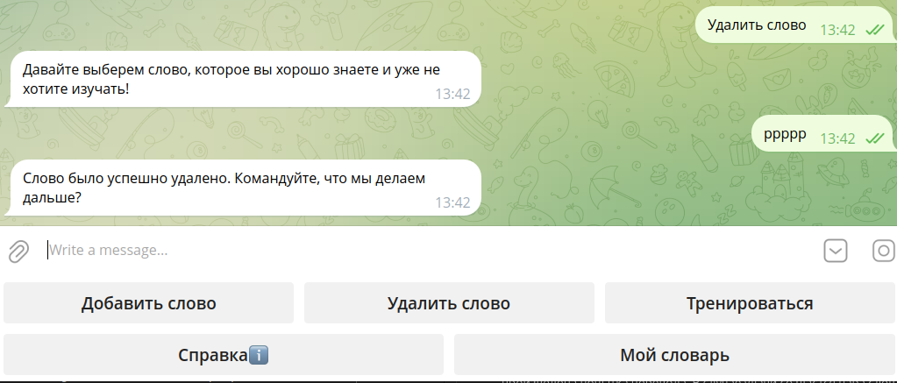

И в случае, если слово не было добавлено вами, и вы хотите его удалить, бот выведет соответствующее уведомление:

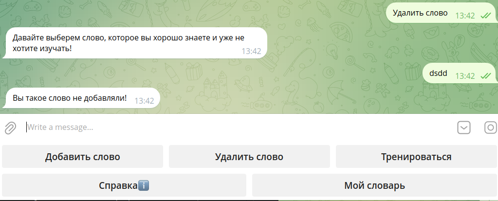

### Режим тренировки

Все пользователи бота могут тренироваться на своих словах, играя в режим тренировки. При нажатии соответствующей кнопки, бот спрашивает, готов ли пользователь потренироваться:

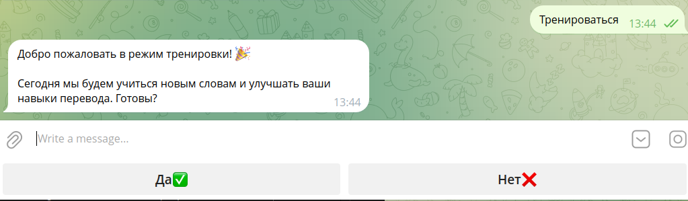

В случае соглашения, бот предлагает слово на английском для перевода на русский, а также 4 варианта ответа, один из которых правильный. В случае ошибки, требуется продолжить попытку, пока не будет угадан правильный ответ. В случае правильного ответа, бот предложит следующее слово и следующие 4 варианта (скриншот с мобильного приложения):

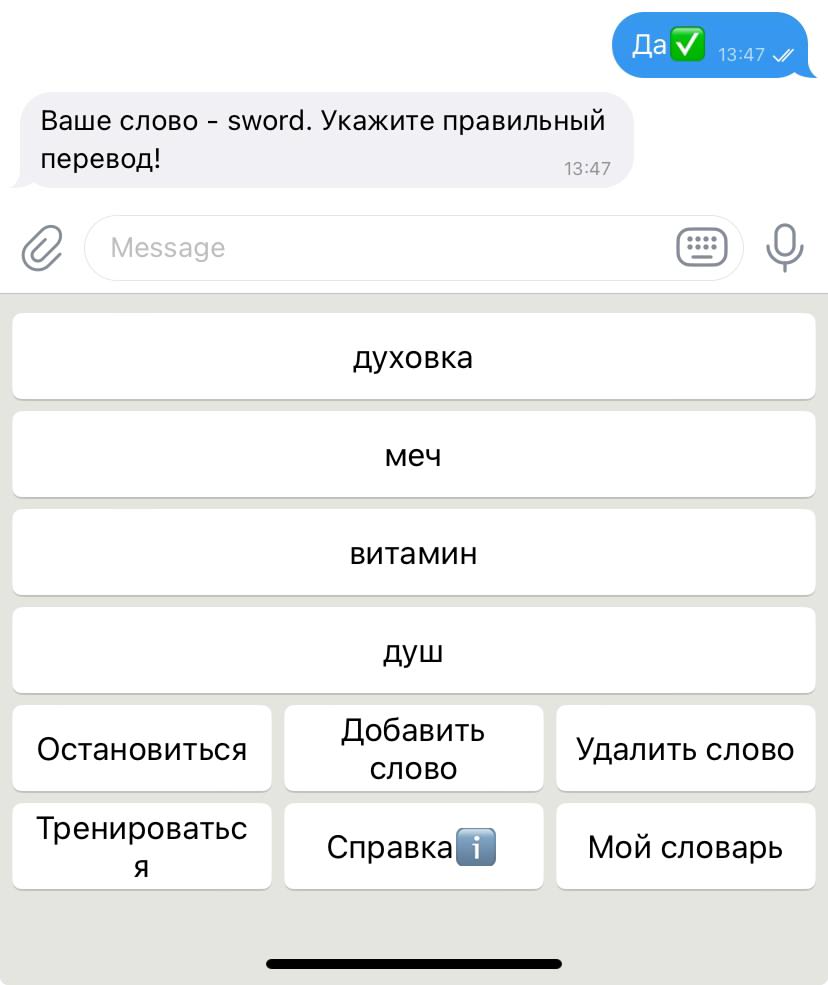

Игра будет продолжаться до того момента, пока пользователь не нажмет кнопку "Остановиться" или пока он не ответит правильно на все вопросы бота.

### Справка

Эта функция запрашивает у бота справочную информацию, которая поможет пользователю сориентироваться при работе с ним.

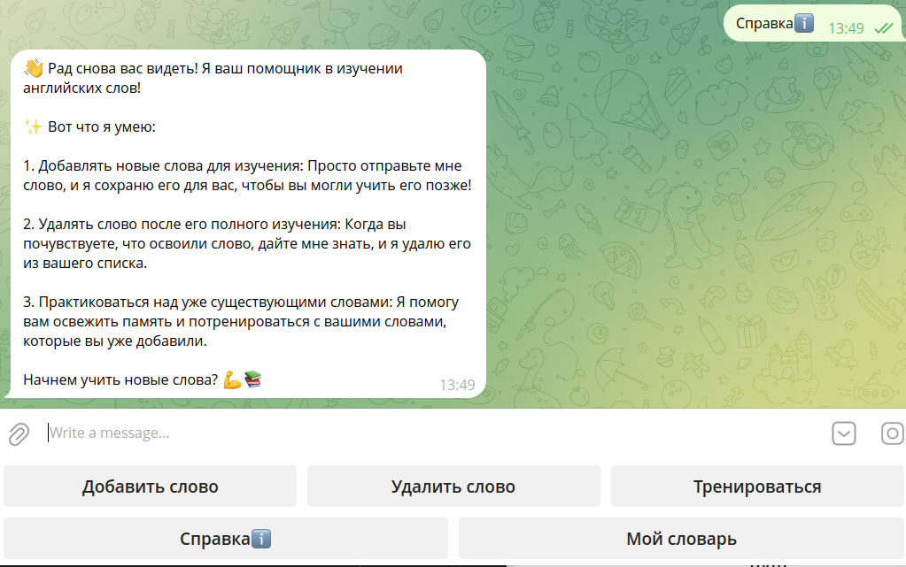

### Мой словарь

Эта функция выводит все слова, которые в данный момент изучает пользователь.

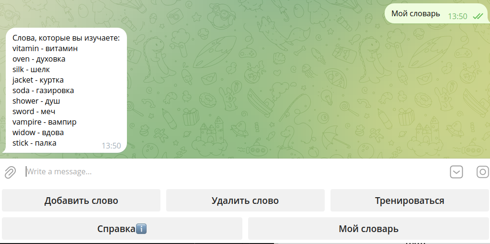

## Про входные данные (файл config.env)

Телеграмм-бот EnglishCards должен запускаться python программой, используя библиотеку telebot для работы с API Telegram. На вход этой программы необходимо передать токен бота в параметре TOKEN файла config.env

Бот взаимодействует с базой данных postgresql, поэтому на вход ему нужно передать логин (LOGIN), пароль для подключения к бд (PASSWORD), название бд (DATABASE_NAME), хост подключения и порт (HOST и PORT)

Бот предоставляет возможность автоматического перевода слов с английского на русский, что осуществляется при помощи Яндекс API для словарей. На вход в параметре TRANSLATE_TOKEN необходимо передать сгенерированный токен яндекс API.

## Про базу данных

База данных, приложенная к телеграмм-боту состоит из трех таблиц:

- Таблица пользователей телеграмм __Users__ (хранится уникальный идентификатор пользователя и его имя, которое он указал боту при знакомстве);
- Таблица пар слов вида "английский-русский" __Words__;
- Таблица связи пользователей и слов __Vocabulary__.

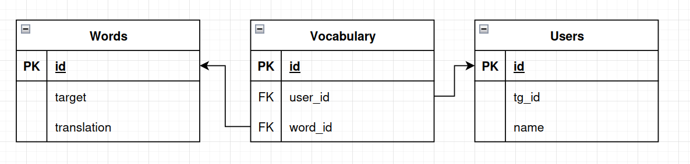

В тексте программы операции, связанные с работой с базой данных осуществляются через ORM SQLAlchemy с драйвером подключения psycopg2.

## Про структуру бота и обработчиков

Телеграмм-бот написан на языке Python, используя библиотеку для работы с API Telegram: telebot.

Для группировки всех возможных ответов (шаблонов ответа) бота, в тексте программы представлен специальный класс BotMessages. Все возможные комманды пользователя хранятся в классе Commands. Все возможные состояния бота по отношению к пользователю хранятся в классе MyStates.

#### Обработчики комманд:

* send_welcome - обрабатывает команды /start и /help. Отправляет приветственное сообщение пользователю. Если пользователь уже зарегистрирован, отображается сообщение о повторном входе. Если нет, запрашивается имя или возможность остаться анонимным.
* add_word - обрабатывает команду добавления нового слова (Commands.ADD). Запрашивает у пользователя новое слово на английском языке.
* delete_word - обработчик комманды для начала процесса удаления слова (Commands.DELETE). Запрашивает у пользователя слово для удаления.
* train_words - обработчик комманды для начала режима тренировки слов (Commands.TRAIN). Запрашивает подтверждение у пользователя.
* show_help_info - обработчик комманды запроса помощи (Commands.HELP). Отображает справочную информацию для пользователя.
* show_dictionary - обработчик комманды запроса словаря (Commands.MY_DICTIONARY). Показывает словарь пользователя с сохраненными словами и их переводами. Функция выполняет запрос к базе данных для получения сохранённых слов  пользователя, формируя их в строку для отображения. Если слова не найдены, уведомляет пользователя.

#### Обработчики состояний:

* set_name - обрабатывает ввод имени пользователя (состояние MyStates.waiting_for_name). Если пользователь ввел имя, оно сохраняется в базе данных. Если пользователь выбрал оставаться анонимным, создается запись с именем "Аноним".
* add_word_input_target - обрабатывает ввод целевого слова от пользователя (состояние MyStates.waiting_for_target_word). Если слово не соответствует требованиям (например, невалидное), уведомляет пользователя. Если слово валидно, запрашивает перевод на русский язык.
* add_word_input_translation - обработчик для получения перевода слова от пользователя (состояние MyStates.waiting_for_translation). Сохраняет целевое слово и его перевод в базе данных.
* delete_word_from_db - обработчик для удаления слова из базы данных (состояние MyStates.waiting_word_to_del). Проверяет, существует ли слово, и, если да, удаляет его.
* train_mode_iteration_start - обработчик для начала итерации тренировки слов (состояние MyStates.training). Выполняет проверку ответа пользователя и предоставляет новые слова для тренировки.
* train_mode_iteration_end - обрабатывает завершение итерации режима тренировки для языкового перевода (состояние MyStates.training_check). Функция проверяет, хочет ли пользователь остановить тренировку, или правильный ли его ответ. Затем отправляет соответствующий ответ и перезапускает процесс тренировки.

## Про утилиты

В программе существуют следующие утилиты:

__models.py__:

* create_tables - создает таблицы в базе данных, если они не существуют;
* fill_db_with_default_data - заполняет базу данных начальными данными;
* get_words_list - возвращает список слов и их переводов для указанного пользователя.

__tg_bot.py__:

* validate_target_word - проверяет, является ли целевое слово допустимым для записи в бд;
* validate_translation - проверяет, является ли перевод допустимым;
* translate_word - переводит английское слово на русский с помощью API Яндекс для словарей.